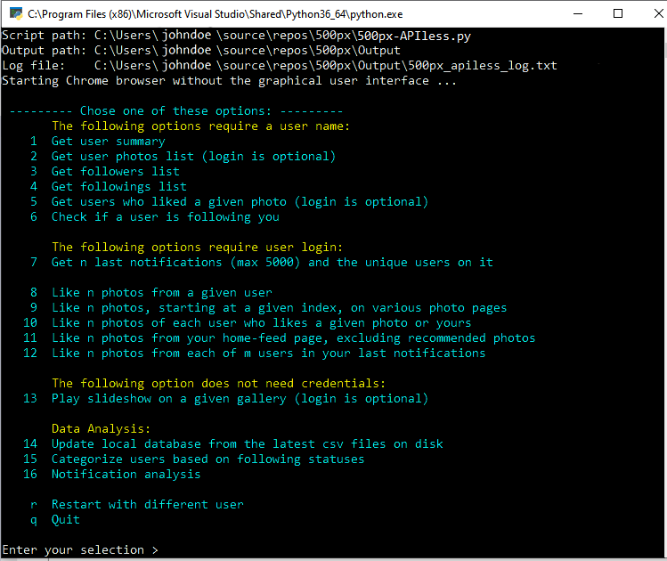

# 500px-APIless: Scraping and automation
A personal project created by curiosity and for fun, to extract information from 500px web site for data analyzing, and to perform some automated processes.

## A BIT OF HISTORY: ##

[500px](https://500px.com) is a famous photo sharing site who recently shutdown its API access (June 24 2018), leaving numerous applications relied on its API, useless.

Without the API, data is harder to collect, and it takes longer time to get them.

But gone the API, arrived the challenges!

As a 500px user who does not want to be manipulated by bots, Initially I just wanted to gather data from the site, manually analyze it and figure it out the users who: 
 - Like every photo I posted, give un-mistaken robot comments, and like my photo back every time I liked theirs
 - Get unbelievable number of followers
 - Follow me then un-follow me if I don't follow them back. 
 - Follow me but do not have any interaction   ...
 
And as a programmer, I got curious, wondering how things can be done. I ended up creating some bots myself.

For testing, I created a dummy account. 
The photographer side of mine tells me: Don't get fool yourself by the "artifical" number of affections. It could be manipulated if one chooses to do so.
The programmer side, on the other hand, says: Why not? you got played. 

At the end of the day, I truly believe that using bots to promote popularity will do you harm. It kills all the fun interacting with 'human' fellow photographers.

Unless, you are in it not for fun, or your fun is getting ahead, no matter what...

Before trying my bots- just for fun, you may say- check out this old but very interesting article I came across some time ago. 
It is from  Andy Hutchinson and it pretty much said it all:
 [The Real Reason You Suck on Photo Sharing Sites: The Bots are Beating You](https://petapixel.com/2017/02/27/real-reason-suck-photo-sharing-sites-bots-beating/) 

## WHAT IT CAN DO SO FAR: ##

- The first 7 options are for data collection. The results of these tasks are saved on disk in CSV and HTML formats. 
CSV files are used for statistical analysis, and in the automated processes. 
HTML files are used for presentation, which happens after a data collection task is completed. They are also served as a tool to sort data in each criteria.

- The options from 8 to 12, are the automated processes, or bots, that will perform some actions. The descriptions are self-explanatory.

- You can play slideshow of photos on various galleries, Popular, Fresh, Upcoming or Editor's choice.  User's galleries or filtered public galleries can also be played by supplying the href.

- The program can also run in un-attended mode, where it takes in command-line arguments and perform a single task. 

Refer to [500px-APIless.docx](/500px-APIless.docx) for a complete command-line syntaxes and the detailed description of each option and its sample outputs.

## ENVIRONMENT: ##

This was developed using Visual Studio Code, testing and run on Windows 10, Python version 3.6

## DEPENDENCIES: ##

Python 3.6 or later 

Selenium and ChromeDriver

## USAGE FOR WINDOW OS: ##

If Python and Selenium are installed properly, you should be able to double-click the file 500px-APIless.py in Window Explorer to run it.

If not, make sure the location of python executable and the ChromeDriver.exe are in the PATH environment, open the Windows Terminal (cmd.exe), navigate to the location of the python script and type:
 python.exe 500px-APIless.py

## LIMITATIONS, ISSUES, TO DO LIST: ## 

- Not all exceptions are handled, especially with Selenium’s find_element… methods
- For the requests involved more than 1000 items (list of notifications, photos, users…), processing time takes too long to my liking. 
- In the slideshow, the vertical scrollbar is not always hidden 
- TODO: 
   - [x] Handling more exceptions
   - [x] Use WebDriverWait whenever possible, instead of time.sleep()
   - [x] Putting images thumbnails in the result files
   - [ ] Add ChromeCast support to slideshow
   - [x] Support command-line arguments
   - [ ] Play slideshow in random order
   - [ ] Making a GUI 
   - [ ] Automatic data analysis

Prior to this project, I have zero knowledge about python and web scraping. No doubt there are rooms for improvements. 
I left abundant comments in the code to make the intention clear, just in case someone wants to chip in.

Feedback, bug report, contributions are more than welcomed.

## DISCLAIMER: ## 

As in any web scraping, a change in page structure may break one or more options. Hopefully we can adapt when it happens. 

As stated earlier, this project is created for fun and for gaining personal experience with python and web scraping. 

**The owner assumes no responsibility**.

Even though some limits have been set, and some processes have been intentionally slowed down to make it look more human, 
abusing or over-usage may result in your 500px account being banned. 

**Use this at your own risk**.

